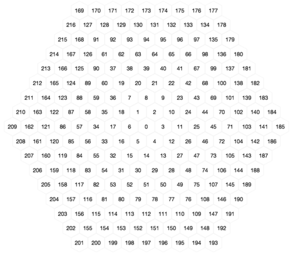
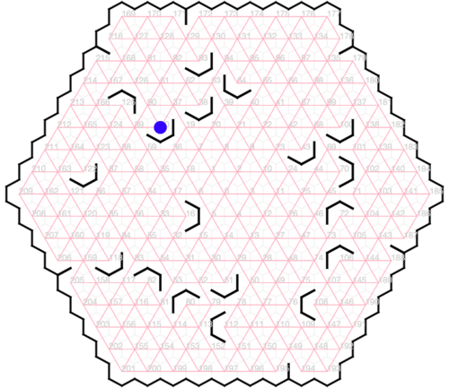
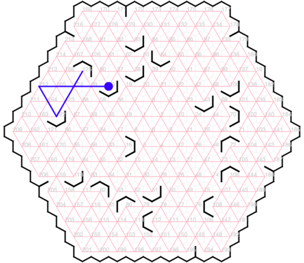
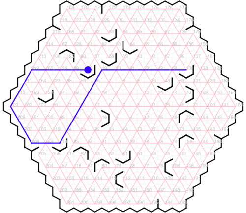
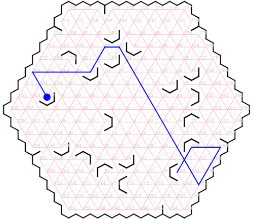
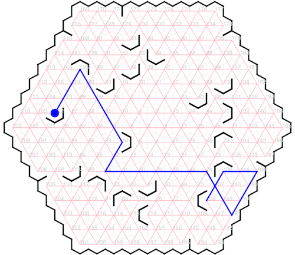
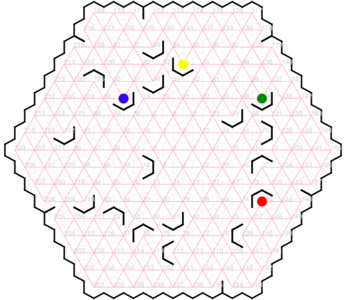
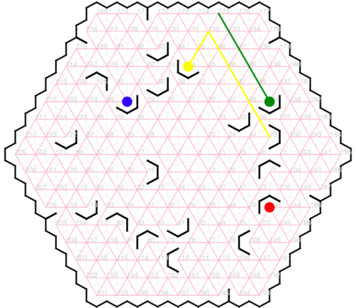
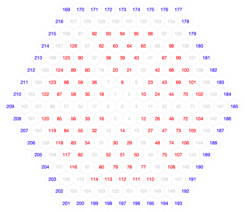

# COMP1110 Assignment 2

*This assignment is only for those enrolled in COMP1110, COMP1510, or COMP6710. COMP1140 students should look [here](https://gitlab.cecs.anu.edu.au/comp1110/comp1140-ass2).*

## Academic Honesty and Integrity

Honesty and integrity are of utmost importance. These goals are *not* at odds with being resourceful and working collaboratively. You *should* be resourceful, you should collaborate within your team, and you should discuss the assignment and other aspects of the course with others taking the class. However, *you must never misrepresent the work of others as your own*. If you have taken ideas from elsewhere or used code sourced from elsewhere, you must say so with *utmost clarity*. At each stage of the assignment you will be asked to submit a statement of originality, either as a group or as individuals. This statement is the place for you to declare which ideas or code contained in your submission were sourced from elsewhere.

Please read the ANU's [official position](http://academichonesty.anu.edu.au/) on academic honesty. If you have any questions, please ask me.

Carefully review the [statement of originality](originality.md) which you must complete.  Edit that statement and update it as you complete each state of the assignment, ensuring that when you complete each stage, a truthful statement is committed and pushed to your repo.

## Purpose

In this assignment you will exercise a number of major themes of the course, including software design and implemention, using development tools such as Git and IntelliJ, using JavaFX to build a user interface.   Above all, this assignment will emphasize group work.

## Assignment Deliverables

The assignment is worth 25% of your total assessment, and it will be marked out of 25. So each mark in the assignment corresponds to a mark in your final assessment for the course. Note that for some stages of the assignment you will get a _group_ mark, and for others you will be _individually_ marked. The mark breakdown and the due dates are described on the [deliverables](http://cs.anu.edu.au/courses/COMP1110/deliverables.html) page.

Your work will be marked via your tutor accessing git, so it is essential that you carefully follow instructions for setting up and maintaining your group repository. At each deadline you will be marked according to whatever is committed to your repository at the time of the deadline. You will be assessed on how effectively you use git as a development tool.

## Problem Description

The assignment involves an hexagonal board game.   The objective of the game is to discover the shortest path between two points on the board within a limited time.   The game can be played by a single player trying to find the best solution in a limited time, or by multiple players vying to be the first to discover the shortest route.

The board consists of 217 positions organized in a hexagon, numbered with zero at the center, and then moving clockwise and outwards as depicted in the following image:

Moves can occur along any of the 60&deg;  diagonals, however, the board also has _barriers_, which limit  movement.   There are three kinds of barriers: _Boundary barriers_ create a perimeter that prevents movement of pieces off the edge of the board. _Crannies_ prevent movement between randomly selected hexagons along the perimeter of the board.  _Nooks_ prevent movement around randomly selected hexagons within the center of the board.  Nooks provide the objectives / destinations of moves.

The following image illustrates a board at the start of a game.  The blue circle at position 60 indicates a playing _piece_, which the player will need to move.  Black lines indicate barriers: _boundary barriers_ which form a complete perimeter, six _crannies_ and eighteen _nooks_.   For example, the _crannies_ in this game include those between positions 194 and 195 (at lower right) and 215 and 216 (at upper left), while there are nooks at positions 93, 64, etc.   Pink lines indicate valid paths along which pieces can be moved.

The goal of each turn is to find the minimal path for a piece to reach a prescribed _nook_ (randomly selected at the start of the turn).   For example, in the game depicted above the piece is in position 60 and the player might be asked to find a path to the nook at 125 (see a solution below).   A _move_ consists of one or more consecutive _steps_ that create a path to the _nook_.   Each step moves along just one of the six possible diagonal directions (the 60&deg;  diagonals: 30&deg;, 90&deg;, 150&deg;, 210&deg;,  270&deg;, and 330&deg;) and continues until a barrier is reached (valid paths marked in pink above).   _The step must always continue until a barrier is reached._

For example, the first step from position 60 (depicted by the blue piece) can only be to points 62 (30&deg;), 212 (270&deg;), and 216 (330&deg;).   The route  60 to 125 via 124 is _not_ legal because the move of the blue piece from 60 at 270&deg;, must continue all the way to 212, where it finally encounters a  barrier.  It cannot stop at intermediate points 89, 124, or 165 because there are no barriers blocking movement at those points.   The same follows for intermediate points in each of the other directions.  Nor can a step go over a blocking barrier (90&deg;, 150&deg;, or 210&deg; in the case of position 60).   At the end of a step, further steps may be taken until the destination nook is reached.  The length of a move is counted in steps taken to reach the destination nook from the starting position.   The fewer the number of steps taken to get from one point to another, the better.

A path from 60 to 125 (three steps):

A path from 60 to 100 (six steps):

Two different paths from 122 to 108 (each eight steps, from among nine possible paths).

### Multiple Pieces

In its simplest version, the game is played using one _piece_.  The game is made more interesting by adding more pieces.   A piece serves as a barrier to another moving piece: the moving piece must stop immediately before it reaches to point where the blocking piece sits.  The following diagram illustrates a game state with four pieces.

When a player takes their turn, they may move as many pieces as desired, but the length of the move is the sum of all of the steps that they take to get the target piece to its objective.   In the example below, the task was to move the piece at 64 (yellow) to location 70.   The player chose to move the green piece from 100 to 175, allowing the yellow piece to make a path from 64 to 132 and then on to 70.  If the green piece were not moved, the yellow piece would have continued to 176 if moved in the 30&deg; direction, rather than stopping at 132.  The length of this move is three (one for the green path plus two for the yellow path).

### Game Play

A game consists of one or more rounds, where each round consists of the player/s trying to find a particular path.  Each subsequent round starts with the pieces in the positions they were left in according to the winning solution in the preceding round.   When there is more than one player, the players will be given a fixed time, and as soon as a player finds a solution, they announce to the other players how many moves their solution will take (their announcement may be wrong, but it will be tested).   The round continues until the time has run out.  If anyone finds a shorter solution, they announce how many moves they can solve it in, and this continues until the time expires.   Once the time has expired, the player with who announced the smallest number of moves must demonstrate their solution (using the mouse to indicate the path).   If correct, that player wins.   If not, the pieces are put back and the player with the next best number of moves provides their solution, and if correct, they win, and so on.

It is left to you to decide exactly how much time is given for a round, how scoring works,  how a game ends, etc.   There are many possibilities and you may do things differently according to whether it is single player or multi-player.   These aspects of the game design are left to you.

### Encoding Game State

The state of a game can be encoded as a string.   Your game will need to be able to initialize itself from such strings.  Strings are used by the testing framework.   A game state string encodes the positions of six crannies, eighteen nooks and the starting positions of from one to four pieces.  Crannies are encoded as a three digit position that designates the first of the two nodes that it separates (e.g. `171` describes the cranny between nodes 171 and 172).  A cranny at 216 separates 216 from 169.   Nooks are encoded with four characters, a three digit position (with leading zeros as necessary) followed by a letter from 'A' to 'F' describing the orientation of the nook, with the letter corresponding to the center barrier, starting with 'A' as 310&deg;.  For example, `016C` describes the nook at point 16 and `080A` describes the nook at point 80 in the example given above.   The string finishes with between one and four piece positions, each represented as a three digit number, so in the example above the pieces are described by the string `060106100064` (60, 106, 100, 64).   The four piece game shown here would thus be represented by the string `171178187194205215093D038D064E070C100D043D106A108F072A080A051D112F082B016C118D060D125B122D060106100064`.

### Legal Game State

To make your game interesting you will need to generate new game states each time a new game is started.  The state of a game is dictated by rules that govern legal board states and legal piece positions.   Each new game may start with a randomly selected set of nooks and crannies, and randomly placed pieces.  Pieces must be placed on nooks, and nooks and crannies are limited to certain board positions, as illustrated here:

The eighteen **nooks** may only be placed at the positions marked in red in the diagram above, and must also comply with the following further restrictions.  There must be _exactly_ three nooks within each of the six triangles that compose the hexagon.  Each may be placed at any of the fifteen legal postions for the respective triangle, however _no two nooks may be adjacent_.  For example, if a nook were placed at location 63, then no nook may be placed in locations 62, 93, 94, 64, 39 or 38.   The orientation of each nook may be chosen randomly among the six valid orientations ('A' .. 'F').

The six **crannies** may only be placed on the perimeter of the game, at the positions marked in blue in the diagram above.   There must be exactly one cranny on each side of the hexagon (i.e. exactly one chosen from among 169 to 176, one chosen from among 177 to 184, etc).

At the start of the game **pieces** must start at nooks, and there may be at most one piece at any position.

At each turn a new objective is determined (the starting piece and the destination nook that the player/s are aiming for).   The starting piece and the objective nook may each be selected randomly but must be solvable (there must be at least one valid path from the starting piece to its destination).

## Legal and Ethical Issues

First, as with any work you do, you must abide by the principles of [honesty and integrity](http://academichonesty.anu.edu.au). I expect you to demonstrate honesty and integrity in everything you do.

In addition to those ground rules, you are to follow the rules one would normaly be subject to in a commercial setting. In particular, you may make use of the works of others under two fundamental conditions: a) your use of their work must be clearly acknowledged, and b) your use of their work must be legal (for example, consistent with any copyright and licensing that applies to the given material). *Please understand that violation of these rules is a very serious offence.*  However, as long as you abide by these rules, you are explicitly invited to conduct research and make use of a variety of sources. You are also given an explicit means with which to declare your use of other sources (via originality statements you must complete). It is important to realize that you will be assessed on the basis of your original contributions to the project. While you won't be penalized for correctly attributed use of others' ideas, the work of others will not be considered as part of your contribution. Therefore, these rules allow you to copy another student's work entirely if: a) they gave you permission to do so, and b) you acknowledged that you had done so. Notice, however, that if you were to do this you would have no original contribution and so would recieve no marks for the assigment (but you would not have broken any rules either).

## Evaluation Criteria

It is essential that you refer to the [deliverables page](http://cs.anu.edu.au/courses/COMP1110/deliverables.html) to check that you understand each of the deadlines and what is required.   Your assignment will be marked via git, so all submittable materials will need to be in git and in the *correct* locations, as prescribed by the [deliverables page](http://cs.anu.edu.au/courses/COMP1110/deliverables.html).

### Part One

Design an implementation the game, _ignoring the graphical user interface for now_. Use UML to model your design (use [https://umbrello.kde.org](https://umbrello.kde.org) to make a pdf).  You should add your .xmi file to your repo, in addition to the pdf that is required by the deliverables.

Start with a text-only implementation of your system which uses the class `comp1110.ass2.HexGame` to satisfy the the criteria below.

**Pass**
* Appropriate use of git (as demonstrated by the history of your repo).
* Successfully implement `HexGame.legitimateBaffles()`.
* Successfully implement `HexGame.legitimageNooks()`.

**Distinction**
All of the Pass-level criteria, plus...
* Successfully implement `HexGame.legitimateGame()`.
* Successfully implement `HexGame.legitimateStep()`.

### Part Two

Create a fully working game, using JavaFX to implement a playable graphical version of the game in a 700x700 window.

Notice that the details of exactly how the game looks etc, are intentionally left up to you.  The diagrams above are for illustration purposes only.   You have a great deal of freedom in terms of the look and feel of the game.  The only firm requirements are that you use Java and JavaFX, that it respects the specification of the game given here, that it be easy to play, that it run in 700x700 window, and that it is executable on a standard lab machine from a jar file called `game.jar`. Your game must successfully run from `game.jar` from within another user's (i.e. your tutor's) account on a standard lab machine (in other words, your game must not depend on features not self-contained within that jar file and the Java 8 runtime).

**Pass**
* Correctly implements all of the <b>Part One</b> criteria.
* Appropriate use of git (as demonstrated by the history of your repo).
* A working implementation of a basic _single-piece, single-player_ hex game implemented in JavaFX.
* Executable on a standard lab computer from a runnable jar file, game.jar, which resides in the root level of your group repo.
* Correctly implements `HexGame.toString()` that produces an encoding of the game represented by a `HexGame` object.
* Generates a correct  game state when a `HexGame` object is created using the constructor that takes a game description.

**Credit**
* _All of the Pass-level criteria, plus the following..._
* The game a correct random game state when a `HexGame` object is created using its default constructor.
* The game indicates a solvable objective to the user at the start of a round, and allows the user to input their solution via the mouse.
* The game checks that users' solution is correct.

**Distinction**
* _All of the Credit-level criteria, plus the following..._
* The game provides a timer, limiting how long each round takes.
* The game supports multiple players.
* The game implements a scoring system.
* The game identifies an optimal solution if the player's solution was not optimal.

**High Distinction**
* _All of the Distinction-level criteria, plus the following..._
* The game supports multiple pieces.
* The game identifies the correctness of multi-piece moves.
* The game identifies optimal multi-piece moves.
* The game has a sense of level of difficulty, selecting moves accordingly (perhaps difficulty increases as the game progresses, or players can choose difficulty level; the details are left to you).

